<h3 align="center">A University Library Management System with Admin Panel</h3>

## ⚠️ Note

This project was implemented based on a tutorial video on YouTube from JS Mastery [Build and Deploy a Fullstack App with Admin Dashboard | Next.js, PostgreSQL, Redis, Auth.js](https://www.youtube.com/watch?v=EZajJGOMWas).

Since the whole project is split into 2-part videos ( Part 2 on **JS Mastery Pro** ), I implemented only Part 1 and added some features on the library page on my own.

## Table of Contents

1. [Introduction](#introduction)
2. [Demo](#demo)
3. [Tech Stack](#tech-stack)
4. [Features](#features)
5. [Quick Start](#quick-start)
6. [What I learned](#learn)
7. [Implementation Notes](#note)
8. [Missing Features](#miss)

## <a name="introduction">Introduction</a>

## <a name="demo">Demo</a>

### Authentication

#### Sign Up

<a href="">
  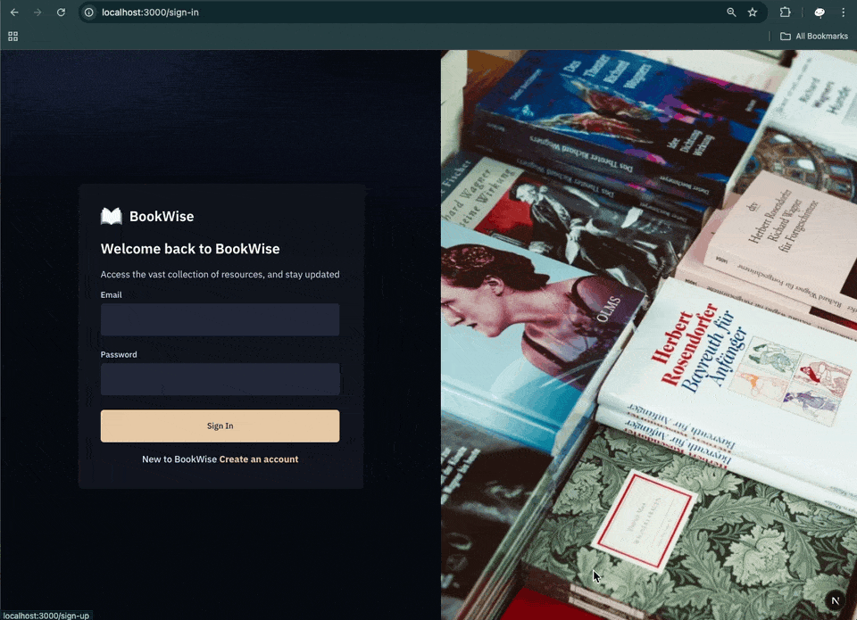
</a>

#### Sign In

<a href="">
  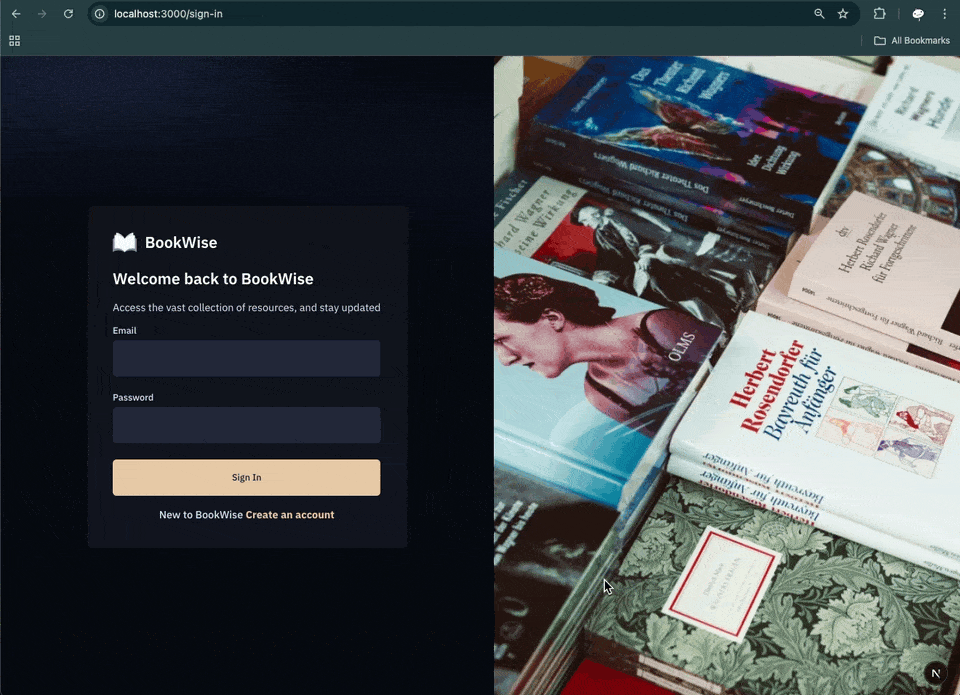
</a>

### Onboarding email

#### Welcome email

<a href="">
  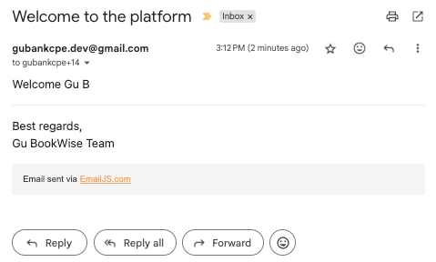
</a>

#### Inactive reminder email

<a href="">
  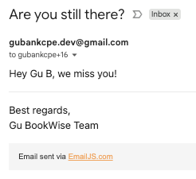
</a>

#### Congratulations email after becoming active again

<a href="">
  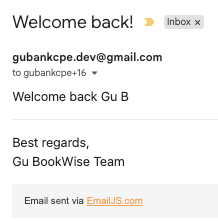
</a>

### User Role

#### Home Page (Latest books)

<a href="">
  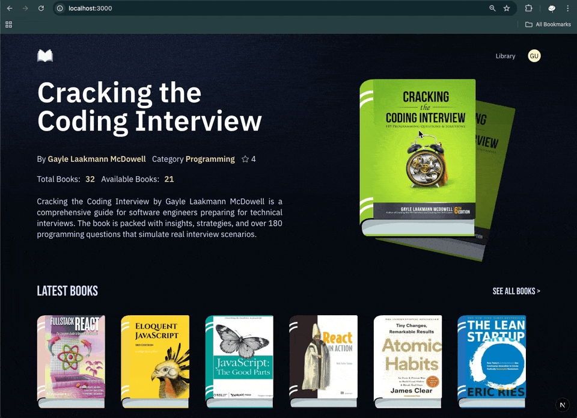
</a>

#### Library Page (All books + pagination)

<a href="">
  
</a>

#### Approve user and change the user role to the admin role in the Neon database

<a href="">
  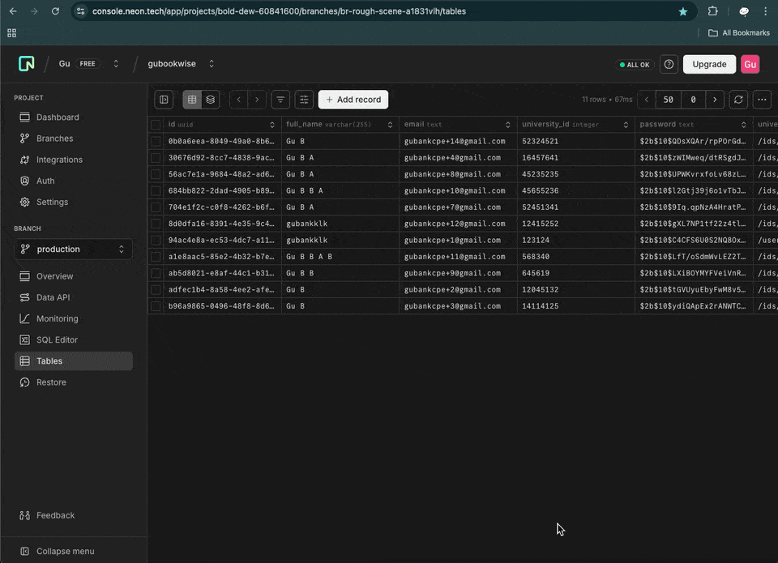
</a>

#### Book Detail Page + Borrow button( For approved users)

<a href="">
  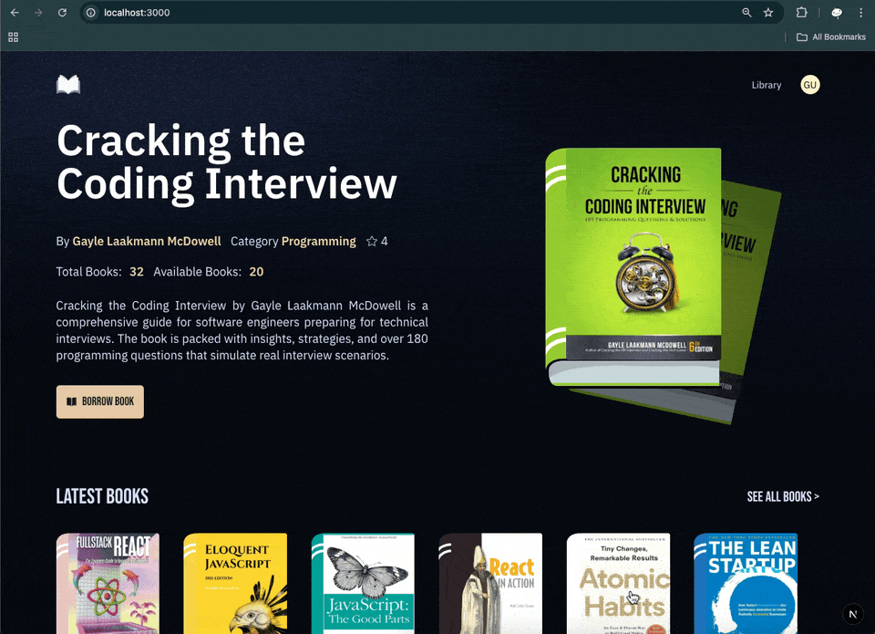
</a>

#### Profile Page (Borrowed books)

<a href="">
  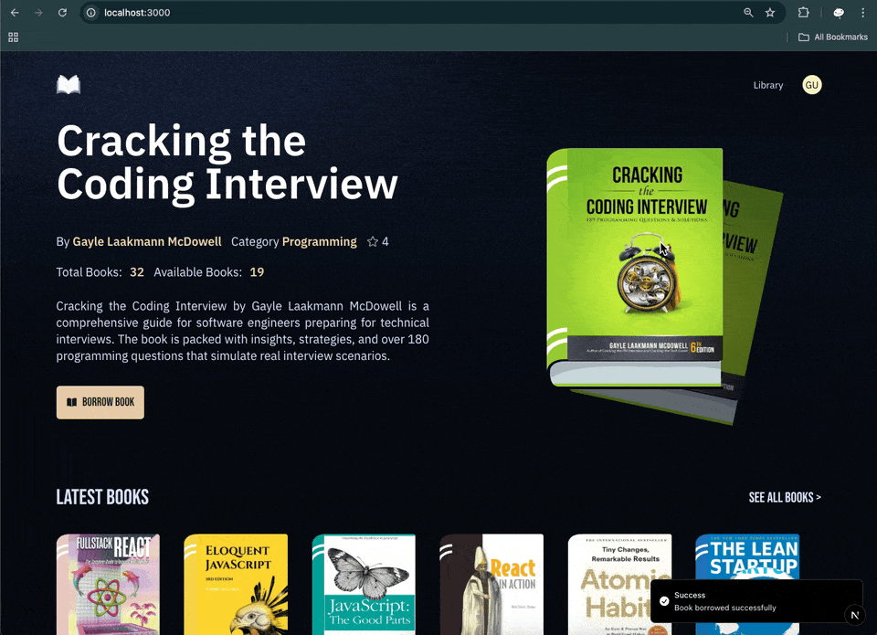
</a>

### Admin Role (Web portal)

#### Add new book

<a href="">
  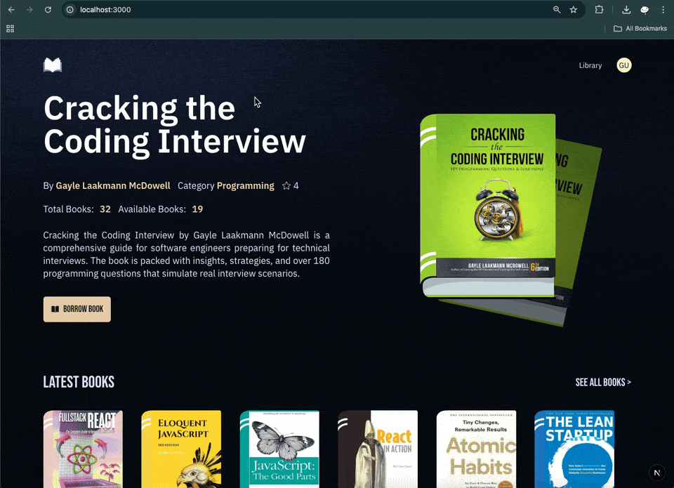
</a>

## <a name="tech-stack">Tech Stack</a>

- React v19 - JS library
- Next.js v15 - React framework
- TypeScript - Type-checking tool
- Auth.js v5 (known as NextAuth.js) - Authentication tool
- Neon - Cloud `PostgreSQL` database
- drizzle - ORM for the SQL database, which includes `PostgreSQL` and provides driver/adapters to connect to cloud databases like `Neon`. It also provides schema generation and migration tools.
- EmailJS - Email sender (Instead of Resend, that recommended by the tutorial video since Resend requires a real domain to send email from)
- Upstash Redis - `Didn't use it for caching the data to display` in this project. But for the `Upstash Rate Limit` feature, which does `Rate limiting` by using `Redis` to track IP address and number of requests per minute(calculated using the Fixed Window algorithm).
- Qstash - Message queue and scheduling service that acts as a messenger between our backend and third-party service with guaranteed delivery and an auto-retry feature. In this project, we send a message to Qstash, and Qstash will send a message to MailJS (Call `MailJS API` to send email). And MailJS will send an email to the user.
- Upstash Workflow - This is something they built on top of `Qstash`. Allow you to schedule automated tasks containing multiple steps in a process, and they will keep track of each step and the result in each step. In this project, we use it to track user status and handle the whole email sending flow for onboarding users, which includes a welcome email, an active/inactive user reminder email based on user status.
- ImageKit - Image and video storage and optimization, and transformations when displaying
- Tailwind CSS v4 - CSS framework
- ShadCN - UI component library
- Vercel - Deployment tool
- React Hook Form - Form handling tool
- Zod - Schema validation tool

## <a name="features">Features</a>

Features of the University Library Management System Project

- Technology Stack: Next.js with TypeScript for scalable development, and Auth.js for robust authentication.
- Onboarding Workflows: Automated welcome emails when users sign up, with follow-ups based on inactivity or activity dates.
- Seamless Email Handling: MailJS for automated email communications
- Home Page: Highlighted books and newly added books with 3D effects.
- Library Page: Pagination for book discovery
- Book Detail Pages: Availability tracking, book summaries, videos
- Profile Page: Track borrowed books
- Book Management Forms: Add new books for admin.
- Advanced Functionalities: Rate-limiting, DDoS protection, and custom notifications.
- Database Management: Postgres with Neon for scalable and collaborative database handling.
- Real-time Media Processing: ImageKit for image and video optimization and transformations.
- Database ORM: Drizzle ORM for simplified and efficient database interactions.
- Modern UI/UX: Built with TailwindCSS, ShadCN, and other cutting-edge tools.

## <a name="quick-start">Quick Start</a>

Follow these steps to set up the project locally on your machine.

### Prerequisites

- Git
- Node.js
- npm
- `@upstash/qstash-cli` to run Qstash and Upstash Workflow on `local mode`

### Cloning the Repository

```bash
git clone https://github.com/bank8426/try-next-nextauth-tailwindcss-shadcn-postgresql-neon-drizzle-redis-resend-vercel.git
cd try-next-nextauth-tailwindcss-shadcn-postgresql-neon-drizzle-redis-resend-vercel
```

### Installation

Install the project dependencies using npm:

```bash
npm install
```

### Set Up Environment Variables

1. Create a new file named `.env.development.local` and copy the content inside `.env.example`
2. Replace the placeholder values with your actual credentials

```env
# imagekit.io
NEXT_PUBLIC_IMAGEKIT_URL_ENDPOINT=
NEXT_PUBLIC_IMAGEKIT_PUBLIC_KEY=
IMAGEKIT_PRIVATE_KEY=

NEXT_PUBLIC_API_ENDPOINT=http://localhost:3000

# neon.tech
DATABASE_URL=

# Added by `npx auth secret`. Read more: https://cli.authjs.dev
AUTH_SECRET=

# upstash redis
UPSTASH_REDIS_REST_URL=
UPSTASH_REDIS_REST_TOKEN=

# upstash qstash
QSTASH_URL=
QSTASH_TOKEN=

# vercel deployed app endpoint
NEXT_PUBLIC_PROD_API_ENDPOINT=

# emailjs
EMAILJS_SERVICE_ID=
EMAILJS_TEMPLATE_ID=
EMAILJS_PUBLIC_KEY=
EMAILJS_PRIVATE_KEY=
```

### Running Qstash and Upstash Workflow in local mode

1. Click on the `Local Mode` button
   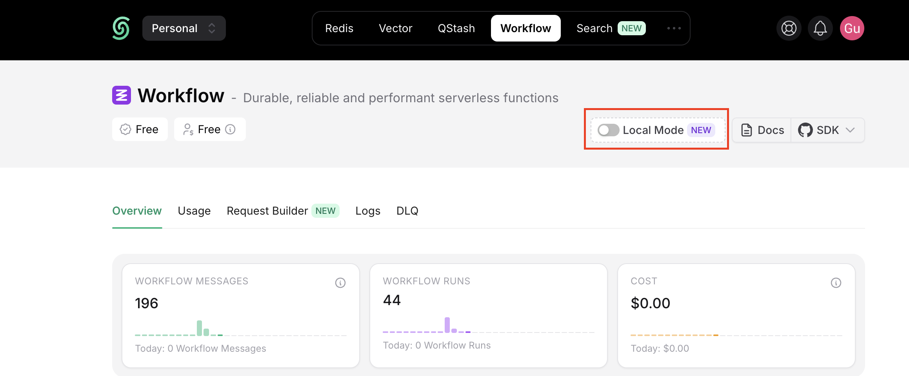
2. Run

   ```bash
   npx @upstash/qstash-cli@latest dev
   ```

   If it is working, you will see `Connection Status` like this.

   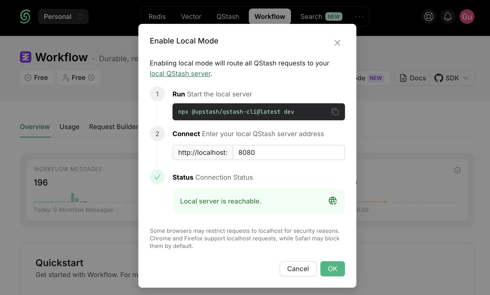

3. Replace `QSTASH_URL` with `http://localhost:8080` in case you run it on port 8080
4. Get `QSTASH_TOKEN`, `QSTASH_CURRENT_SIGNING_KEY`, `QSTASH_NEXT_SIGNING_KEY` from your terminal or go to
   `https://console.upstash.com/workflow/` Quickstart section ( values will be changed when you run it in local mode )

**Running the Project**

```bash
npm run dev
```

Your server will run on [http://localhost:3000](http://localhost:3000/)

## <a name="learn">What I learned</a>

- Auth.js

  - Customize authentication process - By default, they already provide built-in sign-in and sign-up pages for all providers they support. No need to build it from scratch. But you still can do it like in this project, which has a custom sign-in page and custom logic for the email and password authentication process. To do this, you need to update options when initializing `NextAuth`.

    - To use a custom sign-in page, you need to define the path to `signIn` in the `pages` option.
    - To customize the authentication process that works with email/username and password, you need to use `CredentialsProvider` in the `providers` option and then add the `authorize` function to handle the authentication process as you like. You can see more details in https://authjs.dev/getting-started/authentication/credentials

- `react-hook-form` and `zod` as form validation

  - `react-hook-form` supports many 3rd party `schema validation`, and `zod` is one of them. You can use `zodResolver` from `@hookform/resolvers/zod` to integrate `zod` with `react-hook-form` to validate the form data. But also need to add some boilerplate code to make it work. You can see more details in https://react-hook-form.com/docs/useform#resolver in the example zod section

## <a name="note">Implementation Notes</a>

- `getUserState` function

  - There is `incorrect logic` when checking for a non-active user.
  - It means that, if the user is `away between 3 - 30 days`, it will return `non-active`
  - If the user is `away for more than 30 days`, it will return `active`. And that will cause the onboarding email to be sent to only the `active user email`

  ```ts
  ❌
  if (
    timeDifference > THREE_DAYS_IN_MS &&
    timeDifference <= THIRTY_DAYS_IN_MS
  ) {
    return "non-active";
  }
  return "active";
  ```

  - So I changed it to the code below instead

  ```ts
  ✅
  if (timeDifference >= THIRTY_DAYS_IN_MS) {
    return "non-active";
  }
  return "active";
  ```

- Tailwind CSS

  - Same issue as the previous [project](https://github.com/bank8426/try-next-nextauth-tailwind-sanity-sentry). Since the tutorial video was published when `v3` was still in use, but `v4` is out when I try to implement this project. So I need to update the code to match `v4`, and this change affects the structure of the project. Since many files are not needed anymore, like `tailwind.config` and `postcss.config`, some tailwind property names have changed, use `@utility` instead of `@layer utilities` classes, and more. You can see more details in https://tailwindcss.com/docs/upgrade-guide. But for this project, you can see below what I did to make it work. (But honestly, just install TailwindCSS v3 and it will work without a headache)

    - Migration `Tailwind CSS v3` to `Tailwind CSS v4`

      - In `app/globals.css`
        1. Remove old import
        ```
        @tailwind base;
        @tailwind components;
        @tailwind utilities;
        ```
        2. In case of still using `tailwind.config.ts` in `v4`, add the following import instead
        ```
        @import "tailwindcss"
        @config "./../tailwind.config.ts"
        ```
      - `!important` not working anymore, you need to add `!` in front of every property name you want to override.

- Shadcn

  - `Toast` component is `deprecated`. But they have a `sonner` package that provides functionality similar to the `Toast` component.

- Next.js

  - When using images from external sources, you always need to update the configuration in `next.config.js` by adding the `remotePatterns` with the domain of the external source to the `images` property.

    - Example in `next.config.ts`
      ```ts
      const nextConfig: NextConfig = {
        images: {
          remotePatterns: [
            {
              protocol: "https",
              hostname: "placehold.co",
            },
            {
              protocol: "https",
              hostname: "ik.imagekit.io",
            },
            ... // in case you have other external sources
          ],
        },
        ... //other config options
      }
      ```

  - EmailJS
    - There are two ways to send an email
      1. Using SDK (they split into 2 main types of SDK, one is for server side(Node.js or Next.js, but on API route or server components) and one is for browser side, like React or Next.js on client side pages or components). See more in https://www.emailjs.com/docs/sdk/send/
      2. Using REST API
      - Since we design to use Qstash as a middleman to handle the email sending process, we will use the REST API and supply all required fields for EmailJS into the body of `qstashClient.publishJSON`. See more in https://www.emailjs.com/docs/rest-api/send/
      - `accessToken` field in `camelCase`(other parameters are in `snake_case`) is required for EmailJS API, but in document says it is not required.

- ImageKit

  - The file processing limit per month is 100MB. So need to make sure to use a small file when first uploading an image to ImageKit, like when adding mock data into the database, which makes it exceed the limit. And need to make sure not to re-seed data.

- Upstash Workflow

  - This time we followed the official example from Upstash workflow https://upstash.com/docs/workflow/examples/customerOnboarding, which follows their recommended best practices, not like in another tutorial video that we did in https://github.com/bank8426/try-express-mongodb

**Example new sign-up user and send onboarding email flow between our `backend callback endpoint`(/api/workflows/onboarding), `Qstash`, `Workflow`, and `EmailJS`**

**Noted that**

1. I changed the unit from `day` to `minute` for testing purposes. So wait for 3 minutes and 30 minutes instead of 3 days and 30 days.
2. Every time an endpoint has been called, it replicates all previous steps until it arrives at the code where it left off, which means this endpoint must not be affected by time or randomness. In a step that has already run before, it will use the result of that step instead of running it again.

**1A.** On the `server` side, in the Sign up API

1. After the user signs up successfully, save a new user in the database.
2. Trigger new workflow by using `workflowClient.trigger` method with their required information. In this case, there are 2 important information that need to be provided, which are `url` to our callback endpoint that will handle the request from workflow, and `body` contains initial data for the first step of workflow (in this case, `email` and `fullname`).
3. If everything is correct, `Workflow` will return with `workflowRunId`.

**1B.** On the `Workflow` side, after the `workflowRunId` is created

1. It will call our callback endpoint with `context`, which tracks the current step of the workflow and stores the result of the previous step. In this case, `subscriptionId` since it is in the first step of the workflow.

**2A.** On the `server` side, in the callback endpoint (/api/workflows/onboarding) - ( initial step - `new-signup` )

1. Extract `email` and `fullname` from `context.requestPayload`
2. Call `context.run`, which has a step name `new-signup`.
3. In `context.run`, it will call the `sendEmail` function, which will call `Qstash` to call `EmailJS API` to send an email with necessary parameters. (Optional) Actually, you can supply another callback endpoint to Qstash to call it after calling the EmailJS API. And also fail callback endpoint, in case it fails to call the EmailJS API.
4. If everything is correct, `Qstash` will return with `messageId`.
5. After `context.run`, it will send information from `return` back to the `Workflow` side and track that it has already run the `new-signup` step.

**2B.** On the `Workflow` side, after the `new-signup` step is run

1. Save the result of the `new-signup` step into `context`
2. Call our callback endpoint with the new `context`

**2C.** On the `Qstash` side, after getting a message to call `EmailJS API`

1. Call `EmailJS API` to send an email with supplied parameters on our behalf and track the result on their side.

<a href="">
  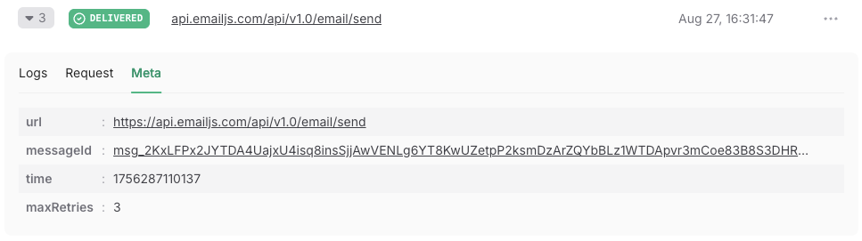
</a>

Note that `Workflow` and `Qstash` are run independently.

**3A.** On the `server` side, in callback endpoint (subscription/reminder) - (after`new-signup` - `wait-for-3-days`)

1. after `context.run` `new-signup`
2. It runs `context.sleep` with `wait-for-3-days` to wait for 3 days
3. After `context.sleep`, it will send information back to the `Workflow` side and track that it has already run the `wait-for-3-days` step.

**3B.** On the `Workflow` side, after the `wait-for-3-days` step is run

1. Wait until the expected time
2. Call our callback endpoint with the new `context`

<a href="">
  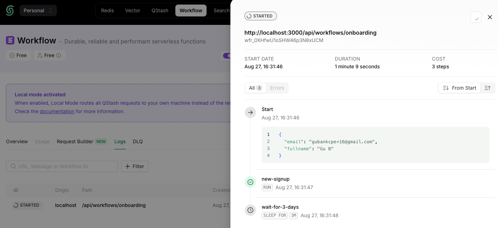
</a>

**4A.** On the `server` side, in the callback endpoint (subscription/reminder) - (after `wait-for-3-days` - `check-user-state`)

1. After `context.sleep` `wait-for-3-days`
2. It will go inside an infinity `while` loop
3. Call `context.run` with `check-user-state`, which will call the `getUserState` function with `email` to check the user state and return it as a result
4. After `context.run`, it will send information from `return` back to the workflow side and track that it has already run the `check-user-state` step.

**4B.** On the `Workflow` side, after the `check-user-state` step is run

1. Save the result of the `check-user-state` step into `context`
2. Call our callback endpoint with the new `context`

**5A.** On the `server` side, in the callback endpoint (subscription/reminder) - (after `check-user-state` - `send-email-non-active` or `send-email-active`)

1. After `context.run` `check-user-state` return
2. I save data in the `state` variable
3. It will continue to check the condition

- If `state` is `non-active`, it will run `context.run` with `send-email-non-active`, which will call `sendEmail` function with `email` to send an email to the user to notify them that they are not active.
- If `state` is `active`, it will run `context.run` with `send-email-active`, which will call `sendEmail` function with `email` to send an email to welcome the user back

4. In the `sendEmail` function, it will call `Qstash` to call `EmailJS API` to send an email with the necessary parameters. (Optional) Actually, you can supply another callback endpoint to Qstash to call it after calling the EmailJS API. And also fail callback endpoint, in case it fails to call the EmailJS API.
5. If everything is correct, `Qstash` will return with `messageId`.
6. After `context.run`, it will send information back to the `Workflow` side and track that it has already run the `send-email-non-active` or `send-email-active` step.

**5B.** On the `Workflow` side, after the `send-email-non-active` or `send-email-active` step is run

1. Save the result of the `send-email-non-active` or `send-email-active` step into `context`
2. Call our callback endpoint with the new `context`

**5C.** On the `Qstash` side, after getting a message to call `EmailJS API`

1. Call `EmailJS API` to send an email with supplied parameters on our behalf and track the result on their side.

<a href="">
  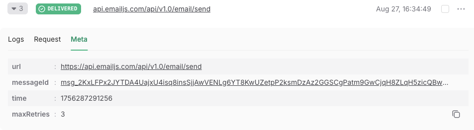
</a>

Note that `Workflow` and `Qstash` are run independently.

**6A.** On the `server` side, in callback endpoint (subscription/reminder) - (after `send-email-non-active` or `send-email-active` - `wait-for-1-month`)

1. After `context.run` `send-email-non-active` or `send-email-active`
2. It will run `context.sleep` with `wait-for-1-month` to wait for 1 month
3. After `context.sleep`, it will send information back to the `Workflow` side and track that it has already run the `wait-for-1-month` step.

**6B.** On the `Workflow` side, after the `wait-for-1-month` step is run

1. Wait until the expected time
2. Call our callback endpoint with the new `context`

<a href="">
  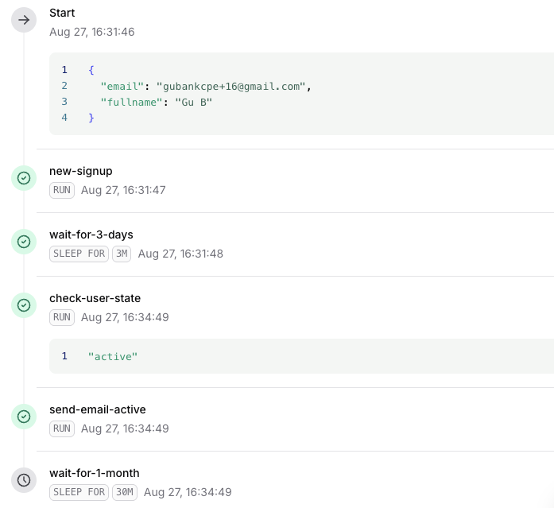
</a>

**7.** Then back to the top of the `while` loop, like at step 4, and continue the whole process again for our `callback endpoint`, `Workflow`, and `Qstash`.

<a href="">
  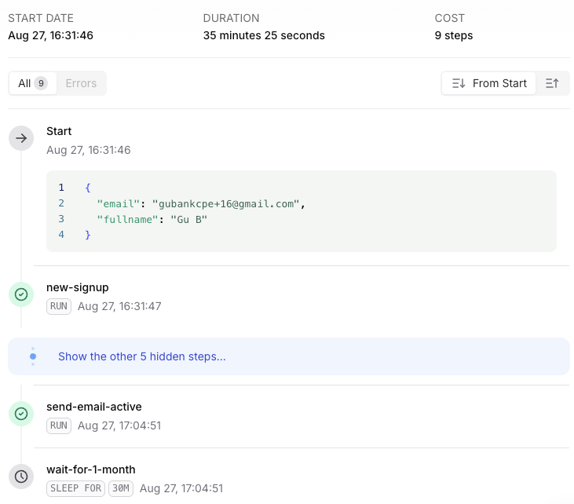
</a>

## <a name="miss">Missing Features</a>

- Remider email

  - Approved account email
  - Borrowed book reminder email
  - Borrowed book due date reminder email
  - Borrowed book overdue reminder email (Penalty)

- User Panel

  - Library page
    - Search
    - Sort (Oldest, Newest, Available, Highest rated)
  - Book detail page
    - Similar books
  - User profile page
    - Borrowed books
      - Due date
      - Download receipt
    - Profile
      - Name, university ID, university card, and account status

- Admin Panel
  - Home
    - Statistics compared to the previous month
      - total borrowed books
      - total users
      - total available books
    - Recently added books
    - Borrow requests
    - Account requests
    - Search
  - User management
    - List
    - Search
    - Pagination
    - Edit user role (Admin, User)
    - View the user's university ID card
  - Book management
    - List
    - Search
    - Pagination
    - Edit book
  - Borrow records
    - List
    - Search
    - Pagination
    - See the borrowed book receipt
    - Set borrow book status (Borrowed, Returned, Overdue)
  - Account requests
    - List of user accounts
    - Approve/Revoke user account
